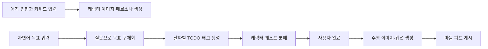
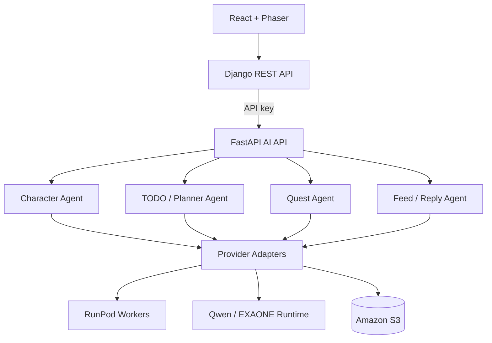

# 몽글마을 AI

> 애착 인형을 AI 캐릭터로 만들고, 막연한 목표를 실행 가능한 TODO와 퀘스트로 바꾸는 에이전트 서비스

[](https://www.python.org/)
[](https://fastapi.tiangolo.com/)
[](https://langchain-ai.github.io/langgraph/)

<p align="center">
  
</p>

## 프로젝트 개요

기존 TODO 앱은 계획을 적는 데는 도움을 주지만, 계획을 시작하고 지속할 정서적 동기를 만들기는 어렵습니다. 몽글마을은 사용자의 애착 인형을 AI 주민으로 만들고, 자연어 목표를 일정과 TODO로 구체화한 뒤 캐릭터 퀘스트와 피드로 연결합니다.

- **대상 사용자**: 계획 수립과 꾸준한 실천에 어려움을 겪는 20~30대
- **핵심 경험**: 목표 입력 → TODO 구체화 → 캐릭터 퀘스트 → 완료 보상 → AI 피드
- **AI 서비스의 역할**: 구조화된 계획, 캐릭터 페르소나, 퀘스트, 이미지·캡션 및 답글 생성

| 영역 | 저장소 | 역할 |
| --- | --- | --- |
| Web | [mongle-web](https://github.com/bigmooon/mongle-web) | React UI와 Phaser 마을 화면 |
| Server | [mongle-server](https://github.com/bigmooon/mongle-server) | 인증·도메인 API·비동기 작업 관리 |
| AI | **현재 저장소** | LLM/VLM 에이전트와 FastAPI 추론 API |

## 사용자 흐름



## 담당한 부분

이 저장소에서는 에이전트 설계부터 API·배포·평가까지 AI 기능의 전체 흐름을 구현했습니다. 아래 항목은 병합된 PR로 확인할 수 있습니다.

- **에이전트 구조**: 멀티턴 파이프라인과 상태 없는 엔진·어댑터 경계를 설계했습니다. ([#26](https://github.com/mong-studio/mongle-ai/pull/26), [#44](https://github.com/mong-studio/mongle-ai/pull/44))
- **서비스 API**: FastAPI 의존성 주입과 기능별 엔드포인트를 구성했습니다. ([#45](https://github.com/mong-studio/mongle-ai/pull/45), [#48](https://github.com/mong-studio/mongle-ai/pull/48))
- **학습·평가**: SFT 데이터셋, LoRA 학습 하네스, 언어 품질 게이트와 모델 벤치마크를 구축했습니다. ([#50](https://github.com/mong-studio/mongle-ai/pull/50), [#59](https://github.com/mong-studio/mongle-ai/pull/59), [#188](https://github.com/mong-studio/mongle-ai/pull/188))
- **비동기 처리**: 캐릭터와 TODO 생성 작업을 제출·조회 방식으로 전환했습니다. ([#100](https://github.com/mong-studio/mongle-ai/pull/100), [#103](https://github.com/mong-studio/mongle-ai/pull/103))
- **배포·운영**: RunPod 워커 배포, OIDC·SSM 기반 배포, 콜드 스타트와 메모리 사용을 개선했습니다. ([#72](https://github.com/mong-studio/mongle-ai/pull/72), [#82](https://github.com/mong-studio/mongle-ai/pull/82), [#121](https://github.com/mong-studio/mongle-ai/pull/121), [#167](https://github.com/mong-studio/mongle-ai/pull/167))
- **출력 안정성**: 날짜 추출, JSON 강제, 환각·압축 게이트와 회귀 평가를 추가했습니다. ([#109](https://github.com/mong-studio/mongle-ai/pull/109), [#135](https://github.com/mong-studio/mongle-ai/pull/135), [#150](https://github.com/mong-studio/mongle-ai/pull/150), [#190](https://github.com/mong-studio/mongle-ai/pull/190))

## 기술적 선택

| 문제 | 선택 | 이유 |
| --- | --- | --- |
| 여러 생성 단계를 안전하게 연결 | LangGraph + Pydantic 상태 모델 | 단계별 입력·출력을 검증하고 실패 지점을 분리하기 위해 |
| GPU 작업의 긴 응답 시간 | Submit/Poll 비동기 API | HTTP 타임아웃과 새로고침 이후 작업 유실을 줄이기 위해 |
| 모델·배포 환경 교체 | Protocol 기반 어댑터 | Qwen, RunPod, Fake provider를 도메인 로직과 분리하기 위해 |
| LLM의 형식 오류 | Schema 검증 + JSON 강제 + 후처리 게이트 | 자연어 품질과 API 계약을 함께 지키기 위해 |
| GPU 메모리 부족 | 멀티 LoRA·VAE tiling·콜드 스타트 최적화 | 제한된 추론 환경에서 여러 기능을 운영하기 위해 |

## 시스템 구조



에이전트는 도메인 검증과 결과 생성을 담당하고, 영속화·카운터·이벤트 발행은 호출자가 담당하도록 경계를 나눴습니다. 자세한 제품·데이터 계약은 [`docs/`](docs/)에서 확인할 수 있습니다.

## 평가 결과

아래 수치는 **프로젝트 제출 당시 평가 환경**의 결과입니다. 이후 모델과 파이프라인이 변경되었으므로 현재 운영 성능으로 일반화하지 않습니다.

| 평가 항목 | 결과 |
| --- | ---: |
| 7개 LLM 후보 중 Qwen2.5-7B 종합점수 | 3.672 / 5 |
| JSON / Schema 준수율 | 0.90 / 0.90 |
| 한국어 출력 비율 | 1.00 |
| 캐릭터 이미지 SSIM | 0.6712 → 0.8378 |
| VLM 객체·색상 인식 | 20/20 · 20/20 |
| 피드 이미지 생성 성공 | 19/20 |

CI workflow는 외부 모델이 필요한 contract 테스트를 제외하고 `agents`, `adapters`, `api` 테스트와 80% 커버리지 게이트를 실행하도록 구성되어 있습니다.

## 빠른 시작

### 요구 환경

- Python 3.11+
- [uv](https://docs.astral.sh/uv/)

```bash
git clone https://github.com/bigmooon/mongle-ai.git
cd mongle-ai
cp .env.example .env
uv sync --group dev
```

GPU나 외부 모델 없이 API 경계를 확인하려면 `.env`를 다음처럼 설정합니다.

```dotenv
LLM_PROVIDER=fake
QUEST_LLM_PROVIDER=fake
FEED_LLM_PROVIDER=fake
IMAGE_PROVIDER=mock
STORAGE_BACKEND=local
STORAGE=local
MONGLE_API_KEY=local-secret
```

```bash
uv run uvicorn api.main:app --reload --port 8010
```

API 문서는 `http://127.0.0.1:8010/docs`에서 확인할 수 있습니다.

### 검증

```bash
uv run pytest
```

외부 Qwen·RunPod가 필요한 contract 테스트는 기본 테스트에서 제외됩니다.

## 주요 API

| 기능 | 방식 | 경로 |
| --- | --- | --- |
| TODO 생성 | 비동기 Submit/Poll | `POST /v1/todo/generate`, `GET /v1/todo/generate/{job_id}` |
| 멀티턴 플래너 | 비동기 Submit/Poll | `POST /v1/todo/chat`, `GET /v1/todo/chat/{job_id}` |
| 캐릭터 생성 | 비동기 Submit/Poll | `POST /v1/character`, `GET /v1/character/{job_id}` |
| 퀘스트 분배 | 비동기 Submit/Poll | `POST /v1/quest/generate`, `GET /v1/quest/generate/{job_id}` |
| 피드·답글 | 동기 생성 | `POST /v1/feed/generate`, `POST /v1/reply/generate` |

## 디렉터리 구조

```text
agents/          기능별 오케스트레이션과 도메인 규칙
adapters/        LLM·RunPod·S3·메모리 구현체
api/             FastAPI 라우터와 비동기 작업 경계
runpod_workers/  LLM·이미지 생성 워커
sft_pipeline/    데이터 준비와 파인튜닝 실험
llm_evaluation/ 모델 비교와 회귀 평가
tests/           단위·통합 테스트
docs/            제품·데이터·기능별 설계 문서
```

## 한계와 다음 과제

- 외부 GPU와 모델 엔드포인트가 필요한 전체 E2E는 로컬 기본 테스트에 포함되지 않습니다.
- 제출 당시 평가 결과와 현재 런타임 모델의 성능을 같은 기준으로 다시 측정할 필요가 있습니다.
- 이미지 생성과 장기 플래너의 지연 시간을 사용자 환경 기준으로 지속 측정해야 합니다.

## 팀

| 이름 | GitHub |
| --- | --- |
| 임정희 | [@bigmooon](https://github.com/bigmooon) |
| 박영훈 | [@aprkaos56](https://github.com/aprkaos56) |
| 정석원 | [@JeongSW123](https://github.com/JeongSW123) |
| 조아름 | [@areum117](https://github.com/areum117) |
| 최하진 | [@hun6684](https://github.com/hun6684) |
