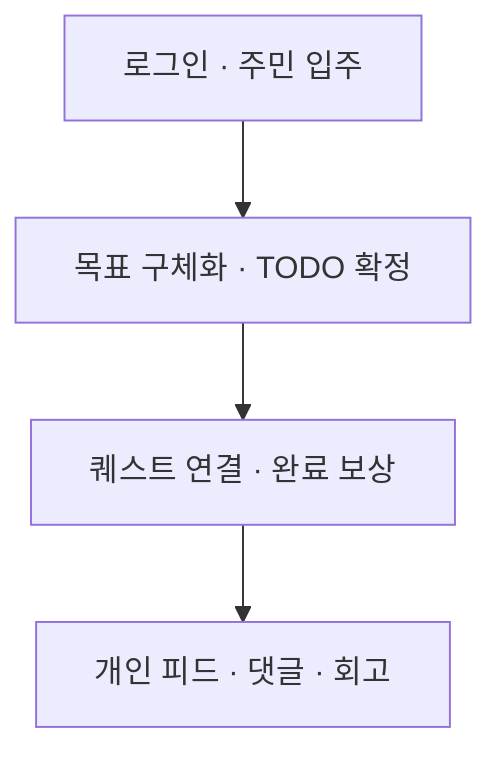
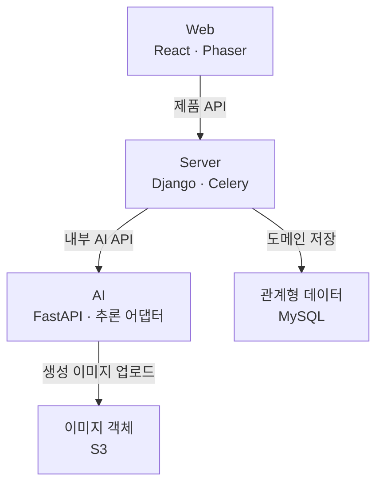

# 몽글마을 AI

> 애착 인형을 AI 캐릭터로 만들고, 막연한 목표를 실행 가능한 TODO와 퀘스트로 바꾸는 에이전트 서비스

[](https://www.python.org/)
[](https://fastapi.tiangolo.com/)
[](https://langchain-ai.github.io/langgraph/)
[](https://github.com/bigmooon/mongle-ai/actions/workflows/api-tests.yml)

<p align="center">
  
</p>

## 프로젝트 개요

기존 TODO 앱은 계획을 적는 데는 도움을 주지만, 계획을 시작하고 지속할 정서적 동기를 만들기는 어렵습니다. 몽글마을은 사용자의 애착 인형을 AI 주민으로 만들고, 자연어 목표를 일정과 TODO로 구체화한 뒤 캐릭터 퀘스트와 피드로 연결합니다.

- **대상 사용자**: 계획 수립과 꾸준한 실천에 어려움을 겪는 20~30대
- **핵심 경험**: 목표 입력 → TODO 구체화 → 캐릭터 퀘스트 → 완료 보상 → AI 피드
- **AI 서비스의 역할**: 구조화된 계획, 캐릭터 페르소나, 퀘스트, 이미지·캡션 및 답글 생성

| 영역 | 저장소 | 역할 |
| --- | --- | --- |
| Web | [mongle-web](https://github.com/bigmooon/mongle-web) | React UI와 Phaser 마을 화면 |
| Server | [mongle-server](https://github.com/bigmooon/mongle-server) | 인증·도메인 API·비동기 작업 관리 |
| AI | **현재 저장소** | LLM/VLM 에이전트와 FastAPI 추론 API |

## 사용자 흐름



포모도로는 실행 중 독립적으로 사용하는 로컬 타이머입니다. 피드 생성 완료를 기다려야 포모도로·회고를 사용할 수 있는 순차 의존 관계는 없습니다. 아래 Server 경로의 공통 prefix는 `/api/v1`입니다.

| 단계 | Web 담당 | Server API·저장 | AI·경계 및 근거 |
| --- | --- | --- | --- |
| 로그인·세션 복구 | `auth/store.ts`, `auth/api.ts`, `shared/api/client.ts` | `POST /auth/login`, `/auth/token/refresh`; `GET /auth/me/`; Kakao 교환·가입 보완 | AI 미호출<br/>[src/features/auth/store.ts](https://github.com/bigmooon/mongle-web/blob/fcd2734b386035fca2d10980a1bb55ec8e90c4ba/src/features/auth/store.ts) · [apps/users/urls.py](https://github.com/bigmooon/mongle-server/blob/11f428734960dab8db60bc5bc7128fb62e8a495d/apps/users/urls.py) · [apps/users/refresh_token_service.py](https://github.com/bigmooon/mongle-server/blob/11f428734960dab8db60bc5bc7128fb62e8a495d/apps/users/refresh_token_service.py) |
| 사진·AI 주민 생성 | `character/api.ts`, `pendingJob.ts`, `App.tsx` | 원본 presign → S3 PUT → 생성 job 제출·조회 → `POST /characters/` 입주 | `/v1/character` → persona·이미지·외형 결과<br/>[src/features/character/api.ts](https://github.com/bigmooon/mongle-web/blob/fcd2734b386035fca2d10980a1bb55ec8e90c4ba/src/features/character/api.ts) · [apps/characters/views.py](https://github.com/bigmooon/mongle-server/blob/11f428734960dab8db60bc5bc7128fb62e8a495d/apps/characters/views.py) · [api/character_creation/router.py](https://github.com/bigmooon/mongle-ai/blob/8f897687560a6ebf179e3a0894a3bfd05b778efc/api/character_creation/router.py) |
| 자연어 목표·계획 구체화 | `todo/todoApi.ts`, `planner-chat/plannerApi.ts` | `/todos/generate/`, `/todos/chat/` 및 job 조회 | 단일 분해 또는 후속 질문·계획 후보. 생성만으로 DB에 저장하지 않음<br/>[src/features/planner-chat/plannerApi.ts](https://github.com/bigmooon/mongle-web/blob/fcd2734b386035fca2d10980a1bb55ec8e90c4ba/src/features/planner-chat/plannerApi.ts) · [apps/todos/ai_client.py](https://github.com/bigmooon/mongle-server/blob/11f428734960dab8db60bc5bc7128fb62e8a495d/apps/todos/ai_client.py) · [agents/todo_creation/planner/pipeline.py](https://github.com/bigmooon/mongle-ai/blob/8f897687560a6ebf179e3a0894a3bfd05b778efc/agents/todo_creation/planner/pipeline.py) |
| TODO·캘린더·태그 저장 | TODO 확정, 플래너 확정, `calendar/CalendarModal.tsx` | `/todos/confirm/`, `/todos/planner-confirm/`, `/todos/`, `/schedules/`, `/calendar/`, `/tags/` | 계획 확정은 Django가 오늘 후보를 Todo, 다른 날짜 후보를 Schedule로 저장; AI `/commit`은 이 제품 경로에서 호출하지 않음<br/>[apps/todos/views.py](https://github.com/bigmooon/mongle-server/blob/11f428734960dab8db60bc5bc7128fb62e8a495d/apps/todos/views.py) · [apps/todos/schedule_urls.py](https://github.com/bigmooon/mongle-server/blob/11f428734960dab8db60bc5bc7128fb62e8a495d/apps/todos/schedule_urls.py) · [src/features/calendar/CalendarModal.tsx](https://github.com/bigmooon/mongle-web/blob/fcd2734b386035fca2d10980a1bb55ec8e90c4ba/src/features/calendar/CalendarModal.tsx) |
| 캐릭터 퀘스트 배정 | `previewTodoQuests`, TODO·플래너 확정 UI | `/todos/quest-preview/` 또는 확정 중 `_assign_quests_to_todos` | `/v1/quest/generate`; TODO **ID**와 캐릭터 정보로 매핑. TODO 내용은 LLM에 전달하지 않음<br/>[apps/todos/views.py](https://github.com/bigmooon/mongle-server/blob/11f428734960dab8db60bc5bc7128fb62e8a495d/apps/todos/views.py) · [agents/quest_generation/pipeline.py](https://github.com/bigmooon/mongle-ai/blob/8f897687560a6ebf179e3a0894a3bfd05b778efc/agents/quest_generation/pipeline.py) |
| 완료·보상 | `completeTodo`, App/캘린더 상태 갱신 | `PATCH /todos/{id}/complete/` → Todo·Quest 완료, 잔액·거래 기록 → DB commit 후 피드 예약 | 피드 생성은 완료 응답과 분리<br/>[src/features/todo/todoApi.ts](https://github.com/bigmooon/mongle-web/blob/fcd2734b386035fca2d10980a1bb55ec8e90c4ba/src/features/todo/todoApi.ts) · [apps/todos/views.py](https://github.com/bigmooon/mongle-server/blob/11f428734960dab8db60bc5bc7128fb62e8a495d/apps/todos/views.py) |
| AI 이미지·캡션 | 생성된 피드·알림을 조회 | Celery `generate_feed_post` → AI 호출 → Post 저장·알림 생성 | `/v1/feed/generate`: 장면 프롬프트 → 이미지 → S3 → 캡션 → 결과<br/>[apps/posts/tasks.py](https://github.com/bigmooon/mongle-server/blob/11f428734960dab8db60bc5bc7128fb62e8a495d/apps/posts/tasks.py) · [agents/feed_generation/pipeline.py](https://github.com/bigmooon/mongle-ai/blob/8f897687560a6ebf179e3a0894a3bfd05b778efc/agents/feed_generation/pipeline.py) |
| 피드·댓글·답글 | `feed/api.ts`, `FeedModal.tsx`, `PostScreen.tsx` | `/posts/`, `/posts/{id}/comments/`, `/posts/{id}/like/`; 댓글 commit 후 600초 지연 예약 | `/v1/reply/generate` → Reply 저장. 자기 캐릭터의 개인 피드<br/>[src/features/feed/api.ts](https://github.com/bigmooon/mongle-web/blob/fcd2734b386035fca2d10980a1bb55ec8e90c4ba/src/features/feed/api.ts) · [apps/posts/views.py](https://github.com/bigmooon/mongle-server/blob/11f428734960dab8db60bc5bc7128fb62e8a495d/apps/posts/views.py) · [apps/posts/tasks.py](https://github.com/bigmooon/mongle-server/blob/11f428734960dab8db60bc5bc7128fb62e8a495d/apps/posts/tasks.py) |
| 포모도로 | `pomodoro/PomodoroHud.tsx`: 25분/5분, 종료 시 다음 모드에서 정지 | 서버 API·집중 이력 DB 저장 없음 | AI 미호출; `localStorage`의 종료 시각으로 복원<br/>[src/features/pomodoro/PomodoroHud.tsx](https://github.com/bigmooon/mongle-web/blob/fcd2734b386035fca2d10980a1bb55ec8e90c4ba/src/features/pomodoro/PomodoroHud.tsx) |
| 회고 | `reflection/api.ts`: 당일 문맥·과거 회고 조회, 작성·수정 | `/reflections/context/{date}/`, `/reflections/`, `/{id}/`; Reflection·보상 거래 저장 | AI 미호출<br/>[src/features/reflection/api.ts](https://github.com/bigmooon/mongle-web/blob/fcd2734b386035fca2d10980a1bb55ec8e90c4ba/src/features/reflection/api.ts) · [apps/todos/reflection_views.py](https://github.com/bigmooon/mongle-server/blob/11f428734960dab8db60bc5bc7128fb62e8a495d/apps/todos/reflection_views.py) |

### 에이전트·모델 추론과 구조화 출력

`api.main:app`이 기능 라우터를 등록하고 `api/deps.py`가 설정별 Ports를 주입합니다. 제품의 인증·사과 잔액·도메인 DB 저장은 Django 책임입니다. AI는 job·대화의 임시 메모리와 이미지 스토리지 I/O를 사용하므로, 외부 상태가 전혀 없는 순수 함수로 설명하지 않습니다.

| 기능 | 파이프라인·출력 | 실제 경계·근거 |
| --- | --- | --- |
| 캐릭터 | 입력 검증 → persona 및 원본 처리 → 이미지 생성 → 업로드 → 엔티티 조립 | [agents/character_creation/pipeline.py](https://github.com/bigmooon/mongle-ai/blob/8f897687560a6ebf179e3a0894a3bfd05b778efc/agents/character_creation/pipeline.py) · [api/deps.py](https://github.com/bigmooon/mongle-ai/blob/8f897687560a6ebf179e3a0894a3bfd05b778efc/api/deps.py). API 경로는 메모리 repository를 사용; 사용자 입주·Character DB 저장은 Django |
| 단일 TODO | 날짜·범위 분류, 명시된 할 일 분해, 후보 또는 범위 밖 응답 | [agents/todo_creation/todo/pipeline.py](https://github.com/bigmooon/mongle-ai/blob/8f897687560a6ebf179e3a0894a3bfd05b778efc/agents/todo_creation/todo/pipeline.py) · [api/deps.py](https://github.com/bigmooon/mongle-ai/blob/8f897687560a6ebf179e3a0894a3bfd05b778efc/api/deps.py). `base` 어댑터 사용; 후보는 확정 전까지 제품 DB에 미저장 |
| 플래너 | 충분성 판단 → 후속 질문/중단·재개 → 날짜별 계획 후보 | [agents/todo_creation/planner/graph.py](https://github.com/bigmooon/mongle-ai/blob/8f897687560a6ebf179e3a0894a3bfd05b778efc/agents/todo_creation/planner/graph.py) · [agents/todo_creation/planner/pipeline.py](https://github.com/bigmooon/mongle-ai/blob/8f897687560a6ebf179e3a0894a3bfd05b778efc/agents/todo_creation/planner/pipeline.py). `thread_id`와 `MemorySaver` 사용 |
| 퀘스트 | 캐릭터 풀 순환과 LLM runner → `generated`·`skipped` | [agents/quest_generation/pipeline.py](https://github.com/bigmooon/mongle-ai/blob/8f897687560a6ebf179e3a0894a3bfd05b778efc/agents/quest_generation/pipeline.py) · [agents/quest_generation/schemas.py](https://github.com/bigmooon/mongle-ai/blob/8f897687560a6ebf179e3a0894a3bfd05b778efc/agents/quest_generation/schemas.py). LangGraph가 아닌 순차 runner; TODO 내용은 입력에서 제외 |
| 피드 | 장면 프롬프트 → 이미지 생성 → S3 업로드 → 캡션 → 결과 | [agents/feed_generation/pipeline.py](https://github.com/bigmooon/mongle-ai/blob/8f897687560a6ebf179e3a0894a3bfd05b778efc/agents/feed_generation/pipeline.py) · [agents/feed_generation/nodes/gen_caption_prompt.py](https://github.com/bigmooon/mongle-ai/blob/8f897687560a6ebf179e3a0894a3bfd05b778efc/agents/feed_generation/nodes/gen_caption_prompt.py). 캡션은 장면 프롬프트·퀘스트·persona 사용; 생성 완료 이미지를 다시 VLM으로 판독하는 단계는 없음 |
| 답글 | 캐릭터·게시글 캡션·사용자 댓글 → 답글 | [agents/reply_generation/pipeline.py](https://github.com/bigmooon/mongle-ai/blob/8f897687560a6ebf179e3a0894a3bfd05b778efc/agents/reply_generation/pipeline.py) · [api/reply_generation/router.py](https://github.com/bigmooon/mongle-ai/blob/8f897687560a6ebf179e3a0894a3bfd05b778efc/api/reply_generation/router.py). 10분 예약과 Reply DB 저장은 Django Celery |

Pydantic 입력/출력 모델, 어댑터의 JSON 파싱·스키마 요청, 날짜·언어·길이 등 기능별 검증을 함께 사용합니다. 모든 경로가 동일한 모델이나 검증기를 사용하는 것은 아닙니다. 예를 들어 RunPod 플래너의 semantic validator는 `None`이며, `PLANNER_OPENAI_*`가 설정되면 플래너의 분류·후속 질문·검증·생성 경로를 별도 호환 API로 바꿉니다.

근거: [api/deps.py](https://github.com/bigmooon/mongle-ai/blob/8f897687560a6ebf179e3a0894a3bfd05b778efc/api/deps.py) · [api/config.py](https://github.com/bigmooon/mongle-ai/blob/8f897687560a6ebf179e3a0894a3bfd05b778efc/api/config.py) · [adapters/todo_creation/qwen_llm.py](https://github.com/bigmooon/mongle-ai/blob/8f897687560a6ebf179e3a0894a3bfd05b778efc/adapters/todo_creation/qwen_llm.py) · [agents/todo_creation/schemas.py](https://github.com/bigmooon/mongle-ai/blob/8f897687560a6ebf179e3a0894a3bfd05b778efc/agents/todo_creation/schemas.py)

| 추론 구성 | 코드에서 확인한 선택지 |
| --- | --- |
| 텍스트 | `qwen` 호환 endpoint 또는 RunPod. 워커 기본 빌드는 Qwen2.5-7B, 플래너 이미지 빌드는 EXAONE-3.5-7.8B. 실제 배포 선택은 환경 변수·템플릿에 따름 |
| 이미지·시각 분석 | 통합 이미지 워커의 image_character·text_character·feed 모드. SDXL·ControlNet·LoRA는 이미지 합성, Qwen VL 계열은 외형 분석 등에 사용; VLM 자체를 이미지 생성 모델이라고 부르지 않음 |
| 로컬 검증 | 캐릭터 fake persona + mock 이미지 + local storage. TODO와 답글을 포함한 전체 제품 mock이 아님 |

근거: [runpod_workers/llm/Dockerfile](https://github.com/bigmooon/mongle-ai/blob/8f897687560a6ebf179e3a0894a3bfd05b778efc/runpod_workers/llm/Dockerfile) · [.github/workflows/deploy-workers.yml](https://github.com/bigmooon/mongle-ai/blob/8f897687560a6ebf179e3a0894a3bfd05b778efc/.github/workflows/deploy-workers.yml) · [runpod_workers/image_gen/handler.py](https://github.com/bigmooon/mongle-ai/blob/8f897687560a6ebf179e3a0894a3bfd05b778efc/runpod_workers/image_gen/handler.py) · [runpod_workers/image_gen/model_refs.py](https://github.com/bigmooon/mongle-ai/blob/8f897687560a6ebf179e3a0894a3bfd05b778efc/runpod_workers/image_gen/model_refs.py) · [runpod_workers/image_gen/pipelines/image_character/mascot_stage.py](https://github.com/bigmooon/mongle-ai/blob/8f897687560a6ebf179e3a0894a3bfd05b778efc/runpod_workers/image_gen/pipelines/image_character/mascot_stage.py) · [api/deps.py](https://github.com/bigmooon/mongle-ai/blob/8f897687560a6ebf179e3a0894a3bfd05b778efc/api/deps.py)

### 메모리·재시도·복구 범위

캐릭터·TODO·플래너·퀘스트의 Submit/Poll은 `asyncio.create_task`와 프로세스 내 job store를 사용합니다. Celery·Redis는 이 AI API의 job backend가 아닙니다. 단일 Uvicorn 프로세스를 전제로 하며, 재시작 시 job과 플래너 체크포인트가 유실됩니다. 새로고침 복구는 Web의 캐릭터 pending 값과 Django DB 상태 조회가 담당하며, AI 프로세스 재시작 복구까지 보장하지 않습니다.

캐릭터 persona/source 업로드는 LangGraph RetryPolicy, 이미지·생성 업로드는 해당 노드의 재시도/정리 로직을 사용합니다. 피드는 이미지·S3·캡션의 특정 예외에 최대 3시도를 적용하고, 퀘스트는 실패 항목을 `skipped`로 반환합니다. 제품의 재처리·보상은 Django 정책과 함께 봐야 합니다.

근거: [api/character_creation/jobs.py](https://github.com/bigmooon/mongle-ai/blob/8f897687560a6ebf179e3a0894a3bfd05b778efc/api/character_creation/jobs.py) · [api/todo_creation/jobs.py](https://github.com/bigmooon/mongle-ai/blob/8f897687560a6ebf179e3a0894a3bfd05b778efc/api/todo_creation/jobs.py) · [api/quest_generation/router.py](https://github.com/bigmooon/mongle-ai/blob/8f897687560a6ebf179e3a0894a3bfd05b778efc/api/quest_generation/router.py) · [agents/todo_creation/planner/graph.py](https://github.com/bigmooon/mongle-ai/blob/8f897687560a6ebf179e3a0894a3bfd05b778efc/agents/todo_creation/planner/graph.py) · [agents/character_creation/pipeline.py](https://github.com/bigmooon/mongle-ai/blob/8f897687560a6ebf179e3a0894a3bfd05b778efc/agents/character_creation/pipeline.py) · [agents/character_creation/nodes/image_generator.py](https://github.com/bigmooon/mongle-ai/blob/8f897687560a6ebf179e3a0894a3bfd05b778efc/agents/character_creation/nodes/image_generator.py) · [agents/character_creation/nodes/generated_upload.py](https://github.com/bigmooon/mongle-ai/blob/8f897687560a6ebf179e3a0894a3bfd05b778efc/agents/character_creation/nodes/generated_upload.py) · [agents/feed_generation/pipeline.py](https://github.com/bigmooon/mongle-ai/blob/8f897687560a6ebf179e3a0894a3bfd05b778efc/agents/feed_generation/pipeline.py) · [apps/characters/tasks.py](https://github.com/bigmooon/mongle-server/blob/11f428734960dab8db60bc5bc7128fb62e8a495d/apps/characters/tasks.py)

## 담당한 부분

이 저장소에서는 에이전트 설계부터 API·배포·평가까지 AI 기능의 전체 흐름을 구현했습니다. 아래 항목은 병합된 PR로 확인할 수 있습니다.

- **에이전트 구조**: 멀티턴 파이프라인과 상태 없는 엔진·어댑터 경계를 설계했습니다. ([#26](https://github.com/mong-studio/mongle-ai/pull/26), [#44](https://github.com/mong-studio/mongle-ai/pull/44))
- **서비스 API**: FastAPI 의존성 주입과 기능별 엔드포인트를 구성했습니다. ([#45](https://github.com/mong-studio/mongle-ai/pull/45), [#48](https://github.com/mong-studio/mongle-ai/pull/48))
- **학습·평가**: SFT 데이터셋, LoRA 학습 하네스, 언어 품질 게이트와 모델 벤치마크를 구축했습니다. ([#50](https://github.com/mong-studio/mongle-ai/pull/50), [#59](https://github.com/mong-studio/mongle-ai/pull/59), [#188](https://github.com/mong-studio/mongle-ai/pull/188))
- **비동기 처리**: 캐릭터와 TODO 생성 작업을 제출·조회 방식으로 전환했습니다. ([#100](https://github.com/mong-studio/mongle-ai/pull/100), [#103](https://github.com/mong-studio/mongle-ai/pull/103))
- **배포·운영**: RunPod 워커 배포, OIDC·SSM 기반 배포, 콜드 스타트와 메모리 사용을 개선했습니다. ([#72](https://github.com/mong-studio/mongle-ai/pull/72), [#82](https://github.com/mong-studio/mongle-ai/pull/82), [#121](https://github.com/mong-studio/mongle-ai/pull/121), [#167](https://github.com/mong-studio/mongle-ai/pull/167))
- **출력 안정성**: 날짜 추출, JSON 강제, 환각·압축 게이트와 회귀 평가를 추가했습니다. ([#109](https://github.com/mong-studio/mongle-ai/pull/109), [#135](https://github.com/mong-studio/mongle-ai/pull/135), [#150](https://github.com/mong-studio/mongle-ai/pull/150), [#190](https://github.com/mong-studio/mongle-ai/pull/190))

## 기술적 선택

| 문제 | 선택 | 이유 |
| --- | --- | --- |
| 여러 생성 단계를 안전하게 연결 | LangGraph + Pydantic 상태 모델 | 단계별 입력·출력을 검증하고 실패 지점을 분리하기 위해 |
| GPU 작업의 긴 응답 시간 | Submit/Poll 비동기 API | HTTP 타임아웃과 새로고침 이후 작업 유실을 줄이기 위해 |
| 모델·배포 환경 교체 | Protocol 기반 어댑터 | Qwen, RunPod, Fake provider를 도메인 로직과 분리하기 위해 |
| LLM의 형식 오류 | Schema 검증 + JSON 강제 + 후처리 게이트 | 자연어 품질과 API 계약을 함께 지키기 위해 |
| GPU 메모리 부족 | 멀티 LoRA·VAE tiling·콜드 스타트 최적화 | 제한된 추론 환경에서 여러 기능을 운영하기 위해 |

## 시스템 구조

AI는 Django가 전달한 입력을 구조화된 생성 결과로 반환하고, 설정된 추론·이미지 스토리지 어댑터를 실행합니다.



이 그림은 요청·저장 방향을 요약합니다. **Web은 AI API를 직접 호출하지 않습니다.** 원본 사진은 Django가 발급한 presigned URL로 Web이 S3에 직접 PUT하며, Django는 이미지 키·메타데이터와 캐릭터 생성 감사 JSON을 관리합니다. AI가 결과를 HTTP 응답/폴링 결과로 반환하면 Django가 도메인 DB에 반영합니다. S3 정적 Web 배포와 미디어 객체 저장은 용도를 구분합니다. Redis는 Server의 Celery broker/result 및 인증 캐시이고, AI job·플래너 대화는 별도 메모리 상태입니다. 이 그림의 MySQL은 제품 DB 구성이며, Django 기본 settings는 DATABASE_URL 미설정 시 SQLite로 대체됩니다. [설정 근거](https://github.com/bigmooon/mongle-server/blob/11f428734960dab8db60bc5bc7128fb62e8a495d/config/settings/base.py).

근거: [src/shared/api/client.ts](https://github.com/bigmooon/mongle-web/blob/fcd2734b386035fca2d10980a1bb55ec8e90c4ba/src/shared/api/client.ts) · [src/features/character/api.ts](https://github.com/bigmooon/mongle-web/blob/fcd2734b386035fca2d10980a1bb55ec8e90c4ba/src/features/character/api.ts) · [apps/characters/tasks.py](https://github.com/bigmooon/mongle-server/blob/11f428734960dab8db60bc5bc7128fb62e8a495d/apps/characters/tasks.py) · [infrastructure/storage/s3.py](https://github.com/bigmooon/mongle-server/blob/11f428734960dab8db60bc5bc7128fb62e8a495d/infrastructure/storage/s3.py) · [api/deps.py](https://github.com/bigmooon/mongle-ai/blob/8f897687560a6ebf179e3a0894a3bfd05b778efc/api/deps.py)

### 작업별 통신 방식

| 작업 | Web → Django | Django → AI | 실행·상태 책임 |
| --- | --- | --- | --- |
| 캐릭터 | `POST /characters/generation-jobs/` → 202; `GET /characters/generation-jobs/{id}/` | Celery가 `POST /v1/character` → 202 후 `GET /v1/character/{id}` 폴링 | Django `CharacterGenerationJob` DB 상태 + AI 메모리 job. 성공 후 사용자의 `POST /characters/`로 입주 |
| 단일 TODO 후보 | `POST /todos/generate/`의 최종 응답 대기 | Django 요청 안에서 `POST /v1/todo/generate` 및 `GET /v1/todo/generate/{id}` | Celery 없음. Web에 job ID를 노출하는 방식이 아님 |
| 멀티턴 플래너 | `POST /todos/chat/` → 202; `GET /todos/chat/{id}/` 폴링 | Django가 `/v1/todo/chat` 제출·조회 중계 | AI 메모리 job·플래너 체크포인트. Django DB job 없음 |
| 퀘스트 | 미리보기·확정 API의 최종 응답 대기 | Django 요청 안에서 `/v1/quest/generate` 제출·조회 | Celery 없음. 결과의 유효한 매핑을 Django가 저장 |
| 피드·답글 | TODO 완료·댓글 등록 후 게시물 재조회 | Celery가 `POST /v1/feed/generate`, `/v1/reply/generate` 결과 대기 | Web 관점 백그라운드, AI API 관점 단일 요청/응답. 별도 feed job 조회 API 없음 |

Web → Django 경로에는 `/api/v1`을 앞에 붙입니다. 캐릭터의 Server job ID와 AI job ID는 서로 다르며, 플래너는 AI job ID를 중계합니다. **Submit/Poll이 곧 Celery 사용이나 영속 복구를 뜻하지는 않습니다.**

근거: [apps/todos/views.py](https://github.com/bigmooon/mongle-server/blob/11f428734960dab8db60bc5bc7128fb62e8a495d/apps/todos/views.py) · [apps/todos/ai_client.py](https://github.com/bigmooon/mongle-server/blob/11f428734960dab8db60bc5bc7128fb62e8a495d/apps/todos/ai_client.py) · [apps/characters/tasks.py](https://github.com/bigmooon/mongle-server/blob/11f428734960dab8db60bc5bc7128fb62e8a495d/apps/characters/tasks.py) · [apps/posts/tasks.py](https://github.com/bigmooon/mongle-server/blob/11f428734960dab8db60bc5bc7128fb62e8a495d/apps/posts/tasks.py) · [api/todo_creation/router.py](https://github.com/bigmooon/mongle-ai/blob/8f897687560a6ebf179e3a0894a3bfd05b778efc/api/todo_creation/router.py) · [api/quest_generation/router.py](https://github.com/bigmooon/mongle-ai/blob/8f897687560a6ebf179e3a0894a3bfd05b778efc/api/quest_generation/router.py)


## 코드·설계 문서 대조 기준

2026-10-10에 세 저장소의 기본 브랜치 코드·환경 변수 예시·Compose·CI·API 클라이언트·라우터와 Drive의 시스템 아키텍처·시스템 구성도·화면 설계서·시나리오 설계서를 대조했습니다. 코드 링크는 검토 당시 커밋으로 고정했습니다. 과거 설계와 현재 구현의 차이, 확인 불가 항목, 수정·검증 내역은 [교차검증 기록](docs/CROSS_REPOSITORY_REVIEW.md)에 남깁니다. 기존 리서치와 평가 수치는 보존하며 현재 운영 성능으로 새로 주장하지 않습니다.

## 관련 설계 문서

| 문서 | 확인할 수 있는 내용 |
| --- | --- |
| [시스템 아키텍처](https://drive.google.com/file/d/15p49ZUIrJCmrSCy3LpU3FbjapZaMXdRc/view) | Web·Server·AI 간 구성과 배포 경계 |
| [모델 테스트 계획 및 결과](https://drive.google.com/file/d/1tozTGjdvfpLf77Z2kIV1dezihjXp5j8Q/view) | 후보 모델 비교 기준과 평가 결과 |
| [인공지능 학습 결과](https://drive.google.com/file/d/1HbuCap2QbnE1OPwZdbhJJ3A1_DMbDImX/view) | 학습 과정과 실험 결과 |
| [AI 데이터 전처리 결과](https://drive.google.com/file/d/1Pxsk397u0joC_Bp-wbrbsc3p86MU6oar/view) | 데이터 정제·가공 과정 |

[전체 프로젝트 산출물 보기](https://drive.google.com/drive/folders/1Lfv49TDbilo4ivoSIpw4v8RDEnEw9quC)

## 평가 결과

아래 수치는 **프로젝트 제출 당시 평가 환경**의 결과입니다. 이후 모델과 파이프라인이 변경되었으므로 현재 운영 성능으로 일반화하지 않습니다.

| 평가 항목 | 결과 |
| --- | ---: |
| 7개 LLM 후보 중 Qwen2.5-7B 종합점수 | 3.672 / 5 |
| JSON / Schema 준수율 | 0.90 / 0.90 |
| 한국어 출력 비율 | 1.00 |
| 캐릭터 이미지 SSIM | 0.6712 → 0.8378 |
| VLM 객체·색상 인식 | 20/20 · 20/20 |
| 피드 이미지 생성 성공 | 19/20 |

평가 조건 보충: LLM 표의 3.672는 7개 후보·5개 기능·총 50개 샘플 기준의 기존 Final 평균이며, 자동 점수 0.45 + GPT-5.5 judge 점수 0.55의 결합입니다. 속도나 현행 EXAONE/LoRA 성능을 나타내는 수치가 아닙니다. SSIM·VLM·피드 수치는 각각 원래 평가 과제의 결과로 유지하며 동일한 50개 LLM 표본의 결과로 합치지 않습니다. [LLM 평가 조건](llm_evaluation/llm-model-cost-summary.md), [제출 당시 모델 평가](https://drive.google.com/file/d/1tozTGjdvfpLf77Z2kIV1dezihjXp5j8Q/view), [학습 결과](https://drive.google.com/file/d/1HbuCap2QbnE1OPwZdbhJJ3A1_DMbDImX/view).

CI workflow는 외부 모델이 필요한 contract 테스트를 제외하고 `agents`, `adapters`, `api` 테스트와 80% 커버리지 게이트를 실행하도록 구성되어 있습니다.

## 빠른 시작

### 요구 환경

- Python 3.11+
- [uv](https://docs.astral.sh/uv/)

```bash
git clone https://github.com/bigmooon/mongle-ai.git
cd mongle-ai
cp .env.example .env
uv sync --group dev
```

GPU나 외부 모델 없이 **캐릭터 API 경계**를 확인하려면 `.env`를 다음처럼 설정합니다. TODO·답글에는 별도 모델 설정이 필요하며, `IMAGE_PROVIDER=mock`은 피드 이미지 전체를 대체하지 않습니다. (근거: [`api/deps.py`](api/deps.py), [로컬 캐릭터 검증](docs/local-character-mock.md))

```dotenv
LLM_PROVIDER=fake
QUEST_LLM_PROVIDER=fake
FEED_LLM_PROVIDER=fake
IMAGE_PROVIDER=mock
STORAGE_BACKEND=local
STORAGE=local
MONGLE_API_KEY=local-secret
```

```bash
uv run uvicorn api.main:app --reload --port 8010
```

API 문서는 `http://127.0.0.1:8010/docs`에서 확인할 수 있습니다.

### 검증

```bash
uv run pytest
```

외부 Qwen·RunPod가 필요한 contract 테스트는 기본 테스트에서 제외됩니다.

## 주요 API

| 기능 | 방식 | 경로 |
| --- | --- | --- |
| TODO 생성 | 비동기 Submit/Poll | `POST /v1/todo/generate`, `GET /v1/todo/generate/{job_id}` |
| 멀티턴 플래너 | 비동기 Submit/Poll | `POST /v1/todo/chat`, `GET /v1/todo/chat/{job_id}` |
| 캐릭터 생성 | 비동기 Submit/Poll | `POST /v1/character`, `GET /v1/character/{job_id}` |
| 퀘스트 분배 | 비동기 Submit/Poll | `POST /v1/quest/generate`, `GET /v1/quest/generate/{job_id}` |
| 메모리 commit | 동기 처리·제품 DB 저장 아님 | `POST /v1/todo/commit` |
| 캐릭터 예열 | best-effort 백그라운드 | `POST /v1/character/warmup` |
| 피드·답글 | 단일 요청/응답 | `POST /v1/feed/generate`, `POST /v1/reply/generate` |

## 디렉터리 구조

```text
agents/          기능별 오케스트레이션과 도메인 규칙
adapters/        LLM·RunPod·S3·메모리 구현체
api/             FastAPI 라우터와 비동기 작업 경계
runpod_workers/  LLM·이미지 생성 워커
sft_pipeline/    데이터 준비와 파인튜닝 실험
llm_evaluation/ 모델 비교와 회귀 평가
tests/           단위·통합 테스트
docs/            제품·데이터·기능별 설계 문서
```

## 배포

| 서비스 | 저장소에 정의된 배포·통신 경로 |
| --- | --- |
| Web | Node 빌드 → S3 정적 배포 → CloudFront invalidation. 개발은 Vite `/api` proxy → `localhost:8000`; 배포는 빌드 시 `VITE_API_BASE` 주입 |
| Server | 테스트 → Docker Hub → AWS OIDC·SSM → EC2 Compose. Nginx TLS → `web:8000` Gunicorn → Django. DB 주소는 `DATABASE_URL`, AI 주소는 아래 두 설정군 사용 |
| AI API | 테스트 → Docker Hub → RunPod CPU Pod 재시작 → `8010/health` 확인. Compose의 단독 API 실행과 GPU 워커는 별도 구성 |
| 추론 워커 | LLM·플래너·이미지 Docker 이미지 빌드. `v*` 태그 workflow에서 RunPod 템플릿 갱신. FastAPI가 RunPod endpoint를 호출하고 결과를 수집 |

Server의 TODO·퀘스트는 `MONGLE_AI_API_BASE`/`MONGLE_AI_API_KEY`, 캐릭터·피드·답글은 `AI_SERVICE_URL`/`AI_SERVICE_TOKEN`을 사용합니다. 두 키는 연결할 AI의 `MONGLE_API_KEY`와 맞춰야 합니다. 컨테이너에서 호스트 AI에 연결할 때 loopback 대신 도달 가능한 호스트 주소를 설정해야 합니다.

이 설명은 배포 **설정** 검증입니다. 실제 DNS·CloudFront origin·RDS 엔진 버전·RunPod 활성 모델·비밀 환경 변수는 저장소만으로 확정할 수 없습니다. Nginx 대기 제한(120초), Server AI 폴링 기본 예산(150초), Gunicorn 제한(180초)이 달라 동기 대기 경로의 타임아웃 위험도 남아 있습니다.

근거: [.github/workflows/deploy-web.yml](https://github.com/bigmooon/mongle-web/blob/fcd2734b386035fca2d10980a1bb55ec8e90c4ba/.github/workflows/deploy-web.yml) · [vite.config.ts](https://github.com/bigmooon/mongle-web/blob/fcd2734b386035fca2d10980a1bb55ec8e90c4ba/vite.config.ts) · [.github/workflows/deploy-server.yml](https://github.com/bigmooon/mongle-server/blob/11f428734960dab8db60bc5bc7128fb62e8a495d/.github/workflows/deploy-server.yml) · [nginx/api.conf](https://github.com/bigmooon/mongle-server/blob/11f428734960dab8db60bc5bc7128fb62e8a495d/nginx/api.conf) · [Dockerfile](https://github.com/bigmooon/mongle-server/blob/11f428734960dab8db60bc5bc7128fb62e8a495d/Dockerfile) · [.env.example](https://github.com/bigmooon/mongle-server/blob/11f428734960dab8db60bc5bc7128fb62e8a495d/.env.example) · [.github/workflows/deploy-api.yml](https://github.com/bigmooon/mongle-ai/blob/8f897687560a6ebf179e3a0894a3bfd05b778efc/.github/workflows/deploy-api.yml) · [.github/workflows/deploy-workers.yml](https://github.com/bigmooon/mongle-ai/blob/8f897687560a6ebf179e3a0894a3bfd05b778efc/.github/workflows/deploy-workers.yml) · [docker-compose.yml](https://github.com/bigmooon/mongle-ai/blob/8f897687560a6ebf179e3a0894a3bfd05b778efc/docker-compose.yml)

## 한계와 다음 과제

- 외부 GPU와 모델 엔드포인트가 필요한 전체 E2E는 로컬 기본 테스트에 포함되지 않습니다.
- 제출 당시 평가 결과와 현재 런타임 모델의 성능을 같은 기준으로 다시 측정할 필요가 있습니다.
- 이미지 생성과 장기 플래너의 지연 시간을 사용자 환경 기준으로 지속 측정해야 합니다.

## 팀

| 이름 | GitHub |
| --- | --- |
| 임정희 | [@bigmooon](https://github.com/bigmooon) |
| 박영훈 | [@aprkaos56](https://github.com/aprkaos56) |
| 정석원 | [@JeongSW123](https://github.com/JeongSW123) |
| 조아름 | [@areum117](https://github.com/areum117) |
| 최하진 | [@hun6684](https://github.com/hun6684) |
