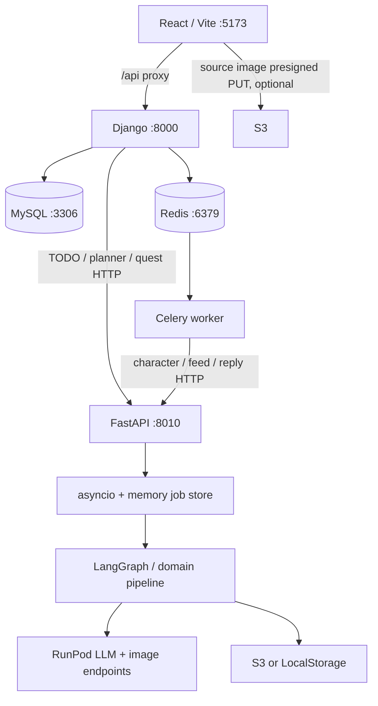

# Architecture inventory

## 2026-09-29 mock 구현 후 갱신

최종 후속 결과: 사진 입력도 실제 브라우저 업로드 → mock 생성 → 미리보기 → 입주까지 PASS. 텍스트/사진 job 2개 CONSUMED를 확인한 후 진단 계정·DB 행·S3 객체 5개를 정리했다. AWS 로그인 만료는 재로그인으로 해결했다.

`IMAGE_PROVIDER=mock`과 기존 fake persona 조합을 구현했다. 실제 브라우저의 텍스트 캐릭터 생성 → Redis/Celery → FastAPI mock → 실제 S3 → 미리보기 → 입주/CONSUMED까지 통과했다. provider 기본값·RunPod adapter·FE polling은 유지했다. 상세 실행법은 `mongle-ai/docs/local-character-mock.md`, 최신 검증/남은 항목은 `local-baseline.md`의 최상단 항목을 따른다. 아래의 “미구현/미검증/AI 기동 실패”는 최초 감사 당시 이력이다.

## 최신 상태 보정 — 2026-09-28

S3는 실제 버킷/인증 연결 후 Django·AI adapter의 저장/조회/삭제 검사를 통과했다. 현재 실행 중 Django의 인증된 source-images API 및 DB 저장도 통과했다. AI config 실패와 대표 생성 flow 미실행은 유지한다. 최신 판정과 한계는 [local-baseline.md](local-baseline.md)의 최신 통합 판정을 따른다.

검사 일자: 2026-09-26. 파일 경로는 workspace 기준. 실제 실행 판정과 소스 확인을 구분한다.

| Layer | Technology | Entry point / config | Local dependency | Current status |
|---|---|---|---|---|
| Frontend | React 18.3.1, TypeScript, Vite 5.4.21, Phaser 3.90, Axios, Zustand; npm/package-lock | `mongle-web/index.html` → `src/main.tsx` → `src/app/App.tsx`; `vite.config.ts` | Node/npm, API 8000 | 초기 화면·build·typecheck·proxy PASS |
| Backend | Django 5.2.14, DRF 3.17.1, SimpleJWT | `mongle-server/manage.py`; `config/settings/{base,development,production,test}.py`; `config/urls.py` | Python 3.12+, DB, Redis | HTTP health·설정·DB 연결 PASS |
| DB | 운영/compose MySQL; Django 기본 SQLite fallback | `config/settings/base.py:DATABASES`; `docker-compose.yml:db`; `apps/*/migrations` | 이번 검사 MySQL 9.7 container, 3306 | MySQL migration·I/O PASS; SQLite 미검증 |
| Broker/cache | Redis 7 Alpine, redis-py 8.0.0 | `REDIS_URL`; `CELERY_BROKER_URL`, `CELERY_RESULT_BACKEND`, `CACHES` | 6379 / DB 0 | 캐시·broker·result PASS |
| Worker | Celery 5.6.3; 선택적 django-celery-beat | `mongle-server/config/celery.py`; `apps/{characters,posts,todos,users}/tasks.py` | Django settings/DB/Redis | 7 task 등록, 실제 task SUCCESS; Beat 미실행 |
| AI API | FastAPI 0.136.3, Uvicorn 0.49.0, LangGraph 0.2.76 | `mongle-ai/api/main.py:create_app`; `api/deps.py:lifespan`; `api/config.py:AppConfig.from_env` | API-only Python dependencies; 선택된 provider 설정 | config 누락으로 기동 FAIL |
| AI background | `asyncio.create_task`, process-memory job stores | `api/{todo_creation,character_creation}/jobs.py`, 피처별 router | 단일 Uvicorn process | 코드 확인; AI 미기동으로 실행 미검증 |
| AI Provider | RunPod Serverless LLM 및 image; 대안 Qwen/OpenAI-compatible; 일부 기존 fake LLM | `api/deps.py`; `adapters/_shared/runpod_client.py`; `adapters/*/runpod_*.py` | RunPod credentials/endpoints 또는 LLM 서버; local image는 ML 환경/LoRA | 외부 운영 중단은 사용자 제공 정보; 호출 미실행 |
| Storage | boto3 S3; AI `LocalStorage` (메모리/data URI) | `mongle-server/infrastructure/storage/s3.py`; `mongle-ai/api/deps.py:_build_storage`; `adapters/character_creation/{s3_storage,local_storage}.py` | 버킷/region/credentials 또는 기존 local 옵션 | S3 실제 PUT/HEAD/GET/DELETE 및 인증 업로드 API PASS; local 구현은 코드 확인 |

## 실제 연결 구조

위 그림은 코드의 연결 관계다. AI 이하 경로를 이번에 실제 통과했다는 의미가 아니다.

## 서비스별 역할

- FE 공통 API 설정: `mongle-web/src/shared/api/client.ts:apiClient`, `${VITE_API_BASE ?? ""}/api/v1`. 미설정 시 `/api/v1`; Vite가 `/api`를 `http://localhost:8000`으로 proxy한다. 5173 → 8000 인증 guard 응답 일치를 확인했다. FE dev host는 `127.0.0.1`이다.
- BE entry: `manage.py`와 Celery는 development 기본값. WSGI/ASGI는 production을 기본 지정하는 코드가 있으므로 실행 entry와 `DJANGO_SETTINGS_MODULE`을 함께 확인해야 한다. 이번에는 `manage.py`/Celery entry를 사용했다.
- BE routing: `/health/`, `/admin/`, `/api/v1/{auth,characters,tags,todos,reflections,notifications,quests,posts}/` 및 schedule/calendar URL include. 인증 기본은 JWT, permission 기본은 `IsAuthenticated`.
- `/health/`는 DB나 Redis를 점검하지 않는 단순 JSON 함수다. 따라서 DB/Redis를 별도로 검사했다. AI `/health`도 단순 JSON이며 lifespan 설정 검사를 먼저 통과해야 한다.
- TODO generate/chat/quest client는 `apps/todos/ai_client.py:TodoAIClient`. 설정은 `MONGLE_AI_API_BASE`와 `MONGLE_AI_API_KEY`.
- 캐릭터 worker는 다른 설정 쌍 `AI_SERVICE_URL`, `AI_SERVICE_TOKEN`을 사용한다. 앞의 설정만 채워서는 캐릭터 연동이 되지 않는다. 두 인증 값은 AI의 `MONGLE_API_KEY`와 일치해야 한다.
- worker 등록: `process_character_generation_job`, `reset_image_gen_count`, `generate_feed_post`, `generate_character_reply`, `fail_incomplete_todos`, `cleanup_expired_refresh_tokens`, `send_reflection_notification`.
- Beat 일정은 `config/settings/base.py:CELERY_BEAT_SCHEDULE`: 자정부터 TODO 실패 처리·회고 알림·이미지 횟수 초기화·refresh token 정리. 즉시 생성 job에는 Beat가 필요 없다.
- AI 프로세스의 job store와 planner 대화 상태는 DB durable queue가 아니다. 프로세스 재시작 시 job 유실 가능; 여러 Uvicorn worker 사이에 공유하지 않는다. 이번 단계에서 변경하지 않는다.

## 기타 외부 의존성

| Dependency | 실제 코드/config | 로컬 baseline 필요 여부 |
|---|---|---|
| S3 source upload/이미지/감사로그 | `infrastructure/storage/s3.py`, AI storage adapters | health 불필요; 사진 업로드 필요. 텍스트 생성은 다음 단계에서 local storage 선택 가능 |
| CloudFront | `mongle-web/.github/workflows/deploy-web.yml`의 invalidation | FE 배포용; local dev 불필요 |
| Kakao OAuth / 공유 SDK | BE `infrastructure/kakao.py`, `apps/users/social_views.py`; FE `features/auth/api.ts`, `features/feed/share.ts` | 해당 기능만 필요 |
| SMTP | BE email settings/회원가입 관련 코드 | 실제 메일 전송 시 필요; 기본 console backend |
| LangSmith | AI `agents/_shared/observability/langsmith.py` | optional tracing; 기본 비활성 |
| Hugging Face / vLLM / GPU | AI `runpod_workers/`, 학습/평가 코드 | 원격 모델 제공·학습용; API-only 진단에는 불필요 |

## 코드와 문서의 차이

1. BE README는 MySQL 중심이지만 base settings는 DB URL이 없으면 SQLite. 이번에는 compose와 같은 MySQL 9.7로 확인했다.
2. `docs/redis-setup.md`의 “Django 캐시로는 사용하지 않습니다”는 현재 `CACHES`와 다르다. 실제로 Redis cache set/get를 검증했다.
3. AI AGENTS의 `--port 8000`은 Django와 충돌한다. Dockerfile/compose와 BE 기본 AI URL에 맞는 8010을 진단에 사용했다.
4. `mongle-server/infrastructure/image_gen/client.py:generate_character_image`에는 `/runsync` 코드가 있지만 현재 Python caller가 검색되지 않았다. 실제 캐릭터 worker는 FastAPI를 호출한다. 이 파일을 주 mock 경계로 삼지 않는다.
5. AI 기본 설정과 `.env.example`의 provider가 다르다. 기본은 qwen/local/local, 예제는 fake LLM/runpod image/s3. 예제만 복사해도 실행되지 않는다.
6. `mongle-ai/AGENTS.md`가 참조하는 `docs/features/todo/AGENTS.md`는 현재 checkout에 없다. 흐름의 근거는 현행 소스에서 확보했다.

자세한 재현 명령·환경변수는 [runtime-dependencies.md](runtime-dependencies.md), 기능별 비교는 [representative-flow.md](representative-flow.md).
